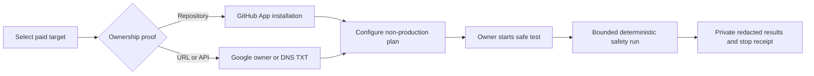

# Live AI Safety and Remote Target Ownership Design

**Status:** approved product direction, pending implementation review
**Date:** 2026-08-14
**Audience:** paid LyraShield AI workspaces

## Outcome

Every paid workspace can prepare and run a bounded live AI safety assessment without a support ticket. A workspace owner’s normal path is three decisions: select a verified staging target, choose no-auth or a saved test account, then start the safe test. Missing prerequisites are setup actions saved for future runs, never a generic “blocked” state.

## Product rules

| Target and activity                          | Authorization requirement                                                                                                                              |
| -------------------------------------------- | ------------------------------------------------------------------------------------------------------------------------------------------------------ |
| Browser-local selected files and pasted code | None. No remote target is contacted and source stays in the browser.                                                                                   |
| Free Lite Check                              | Existing authorization attestation, Terms, Turnstile, rate limiting, and passive/read-only limits. No Google requirement.                              |
| Paid repository scan, any profile            | Active GitHub App installation bound to the workspace and repository.                                                                                  |
| Paid URL/API scan, any profile               | Current verified ownership of the target domain before the first remote request.                                                                       |
| Live AI safety run                           | The remote-target rule plus a non-production target. The workspace’s saved contact, optional test credential, and final owner confirmation are reused. |

The scan profile does not relax ownership. Safe and Quick have lower technical limits; they are not authorization shortcuts. Deep adds broader bounded coverage and a stronger review record, but does not introduce a different ownership model.

## URL/API ownership verification

Use one `TargetDomainVerification` record per workspace and registrable domain. A verified domain can authorize exact-host URL/API targets below that domain; it cannot authorize a lookalike or sibling registrable domain. Verification is reused until it expires, not requested per scan or run.

### Verification methods

1. **Google Search Console (convenience path).** The user connects Google with the read-only Search Console scope. The service queries the Sites list and accepts only `siteOwner`, never full, restricted, or unverified access. A matching `sc-domain:example.com` authorizes subdomains; a URL-prefix property authorizes only the normalized HTTPS origin it names. OAuth tokens remain server-side and are encrypted through the existing credential path.
2. **DNS TXT (universal path).** The service gives the user a short-lived, workspace-bound token for `_lyrashield-verification.<domain>`. The server resolves public authoritative answers and stores a hash of the verified token, resolver evidence, and time. DNS verification must be rechecked before a live safety execution and expires after 90 days.

Existing URL-target attestations remain historical audit records but do not satisfy the paid remote or live safety gate after this release.

## Live AI safety experience

The dashboard exposes **AI safety testing (beta)** to all paid workspaces when the global kill switch is enabled. It is not an invite-only feature and it never presents provider cost or internal accounting.

### Three-step flow

1. **Choose target.** Select a verified URL/API target already marked `LOCAL`, `PREVIEW`, or `STAGING`. HTTPS, no URL credentials, and exact hostname are derived from the target. If the domain is unverified, the page offers Google or DNS verification in place and remembers it for later targets.
2. **Choose access.** Select **No sign-in required** or an existing encrypted test credential reference. No credential value enters the browser, URL, report, telemetry, LLM context, or logs. The incident contact is a workspace setting, prefilled from the owner on first use and editable in Settings, rather than an extra wizard field.
3. **Start safe test.** The five fixed, non-destructive cases and conservative caps are selected by default. An Owner or Security Admin sees one final confirmation: “I authorize this safe test against this staging target.” Members submit the same canonical plan to an owner for approval. Customers cannot add arbitrary prompts, tools, or fuzzing.

The monitor displays current catalog case, request count, elapsed time, a Stop control, and a clear terminal reason. It shows no fabricated percentage or raw prompt/response content.

### State model

`DRAFT → READY → RUNNING → COMPLETED | STOPPED | FAILED`

For a member without the start permission: `DRAFT → PENDING_APPROVAL → APPROVED → RUNNING`. Owner/Security Admin confirmation is both the target-specific authorization and the start action; it is recorded, canonical-plan-bound, and consumed once.

The UI displays the earliest unmet requirement with its direct action: verify domain, choose no-auth or a credential, change target environment, set the workspace incident contact, or request owner approval. It does not frame normal setup as an error.

## Execution and data model

Add a workspace-scoped append-only `LiveAiSafetyPlan` root and `LiveAiSafetyRun` children. Both use forced RLS and explicit workspace/target predicates. `LiveAiSafetySettings` stores the workspace contact once. The plan stores only identifiers and bounded configuration, including `authMode: NONE | CREDENTIAL` and a nullable credential ID; the run stores case ID, deterministic outcome, response hash, duration, request count, and terminal reason. The approval uses the existing immutable approval service with a canonical input hash and is consumed once when execution begins.

The dedicated worker job:

- checks paid entitlement and `LYRASHIELD_AI_SAFETY_BETA_ENABLED=1`;
- reloads the plan in a workspace-scoped transaction and verifies current ownership proof;
- resolves the hostname immediately before each request, rejects private, link-local, loopback, metadata, and changed DNS addresses, forbids redirects, and enforces host equality;
- uses only the five versioned, non-destructive fixtures in `AI_SAFETY_TEST_CATALOG`;
- applies fixed request, time, body, response, and concurrency limits;
- stops immediately on workspace/operator kill switches, a fixture stop condition, credential failure, DNS change, timeout, or provider/network failure;
- never asks an LLM to select a request or decide pass/fail.

Optional encrypted private raw samples require both the plan opt-in and production object storage. They remain unavailable to shared/public reports, analytics, telemetry, and LLM triage.

## Paid LLM triage activation

Triage remains an additive overlay for eligible Standard and Deep repository scans. After the immutable worker digest is promoted, operators enable the existing Key Vault values `worker-ai-triage-enabled=1` and `worker-ai-triage-max-budget-usd=<bounded amount>`, refresh the worker environment, and run one paid eligibility smoke scan. Disabled, budget-exhausted, filtered, or failed triage preserves deterministic and AI-03 results byte-for-byte.

## Acceptance checks

- Free local scans still upload neither source nor result payloads.
- A paid repo scan refuses an unbound GitHub installation in every profile.
- A paid URL/API scan refuses attestation-only, non-owner Google, expired DNS, and cross-domain proofs in every profile.
- A `siteOwner` Domain property authorizes a subdomain; a URL-prefix property does not authorize another origin.
- Every live run rejects production, redirect, private DNS, DNS rebinding, custom fixtures, stale ownership, expired approval, and a second execution of the same approval. A credential is required only when `authMode` is `CREDENTIAL`.
- Cross-tenant reads/writes, public reports, shared reports, analytics, logs, and LLM context exclude plan, verification, credential, and raw sample data.
- Keyboard-only completion of the three-step owner flow and the member approval flow, focus restoration, live status announcements, 390px/mobile, desktop, light/dark, and error/stop states are covered.
